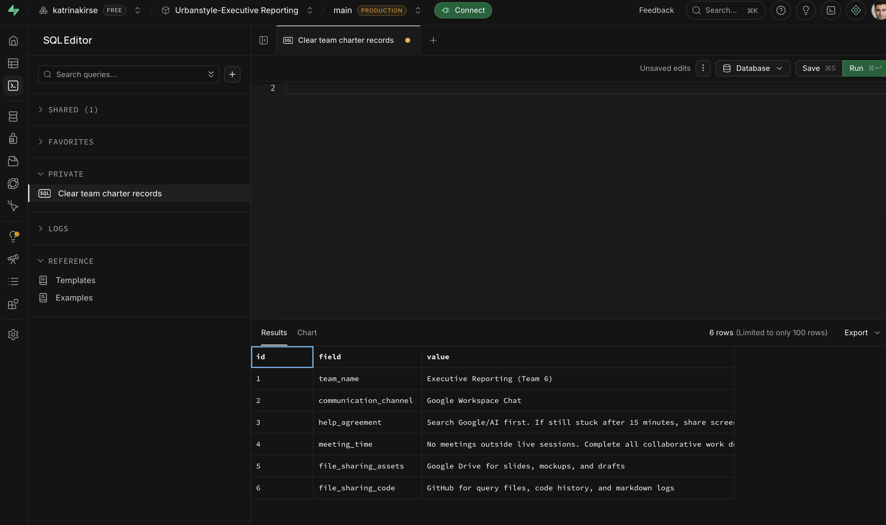

# Week 0 Onboarding & Environment Setup

## 1. Business Problem & Context
Since 2020, UrbanStyle has experienced rapid growth, reaching €3M in revenue in 2024. However, this growth has led to version control chaos, with critical business data scattered across unmanaged spreadsheets. 

To support CEO Kristi Tamm with evidence-based strategic decisions, our mission this week was to transition from "spreadsheet chaos" to a systematic, auditable "one shared queryable source of truth" using relational cloud databases and Git version control.

## 2. My Role & Contributions
In our 5-member team (Executive Reporting), I served as **Member D: Team Charter Coordinator**. My specific responsibilities included:
* Facilitating the creation of our team's social contract (Team Charter) to ensure smooth collaboration.
* Translating our team agreements into a structured SQL database schema.
* Creating and populating the `team_charter` table in our shared Supabase database.
* Successfully testing and querying the remote table from my local VS Code connection.

## 3. Tech Stack Used
* **Git & GitHub:** For personal portfolio version control and team code collaboration.
* **Supabase (PostgreSQL):** As our team's secure cloud relational database.
* **VS Code (with SQLTools extension):** As the primary local environment for database connections.

## 4. Methodology & Evidence
I executed SQL scripts via Supabase's SQL Editor to establish a queryable team contract. The system is fully operational.
* **SQL Query Used:** See `hello_urbanstyle.sql`
* **Proof of Completion:** 
  

## 5. Reflections & AI Transparency
* **What Surprised Me:** I was surprised by how quickly we could connect multiple local VS Code environments to a shared cloud database, but we learned a valuable lesson in debugging terminal SQL syntax loops.
* **AI Assistance:** I utilized AI (Notebook/Gemini) to double-check my SQL syntax for creating tables and to help format this markdown documentation.
